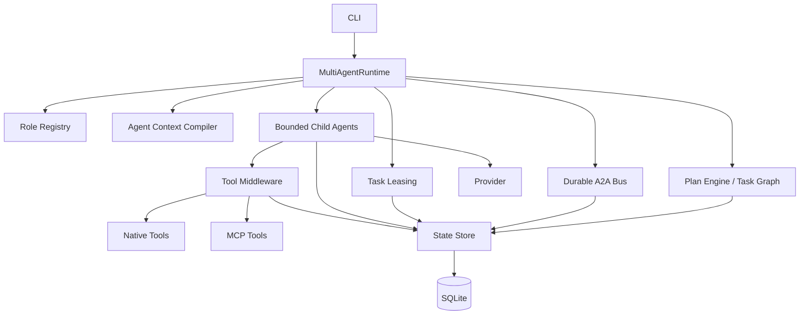
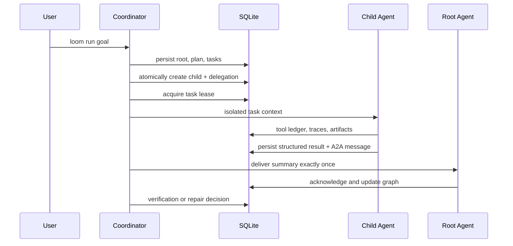

# Architecture

Loom V0.4 adds a coordination layer around the V0.3 task graph. The existing single-agent `VerifiedExecutionRuntime` remains available for migrated agents and compatibility tests.

## Package boundaries

| Package | Responsibility |
| --- | --- |
| `@loom/core` | Shared lifecycle, delegation, message, result, lease, memory, and trace contracts. |
| `@loom/state` | SQLite migrations v1–v5, transactions, durable records, and queries. |
| `@loom/planner` | Plan creation, dependency scheduling, V0.3 verified execution, retries, and recovery. |
| `@loom/coordinator` | Agent registry operations, roles, context isolation, A2A bus, delegation, bounded coordination, recovery, and cancellation. |
| `@loom/tools` | Tool registry, permissions, approvals, idempotency, result limits, and native tools. |
| `@loom/providers` | Mock and OpenAI-compatible provider normalization. |
| `@loom/context` | Priority-based context compilation. |
| `@loom/skills` | Project skill discovery. |
| `@loom/mcp` | Stdio MCP discovery and tool adaptation. |
| `@loom/runtime` | V0.2-compatible `AgentLoop`. |
| `@loom/evals` | V0.3 regression and V0.4 multi-agent scenarios. |
| `@loom/cli` | Config, service wiring, commands, and output. |

## Coordination sequence

SQLite is the source of truth. Runtime objects are disposable projections. V0.4 uses synchronous SQLite transactions and bounded asynchronous workers inside one process; it is not a distributed system.
