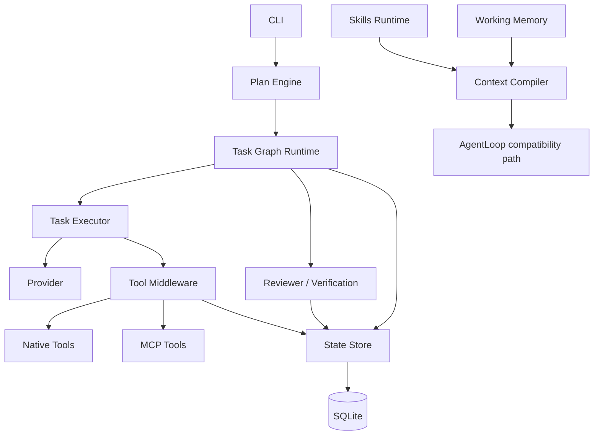
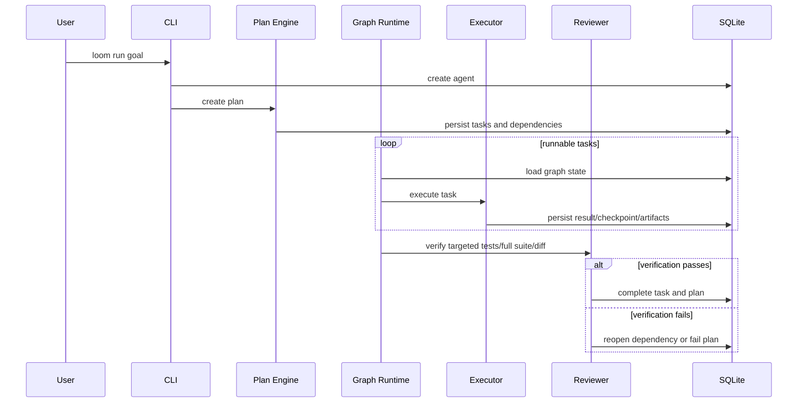

# Architecture

Loom V0.3 is a single-process, single-agent runtime. Separation refers to responsibilities and phases, not separate autonomous agents.

## Package boundaries

| Package | Responsibility |
| --- | --- |
| `@loom/core` | Shared contracts and lifecycle types. |
| `@loom/state` | SQLite loading, migrations, durable records, and queries. |
| `@loom/planner` | Plan creation, dependency scheduling, execution phases, retries, reviewer gating, and recovery. |
| `@loom/tools` | Tool registry, permissions, approvals, idempotency ledger, result limits, and native tools. |
| `@loom/providers` | Mock and OpenAI-compatible provider normalization. |
| `@loom/mcp` | Stdio MCP initialization, discovery, and tool adaptation. |
| `@loom/context` | Priority-based context compilation for the compatibility runtime. |
| `@loom/skills` | Project skill discovery and frontmatter parsing. |
| `@loom/runtime` | V0.2-compatible `AgentLoop` and context/provider loop. |
| `@loom/evals` | Fixed deterministic orchestration scenarios. |
| `@loom/cli` | Config loading, command parsing, service wiring, and output. |

## V0.3 execution path

SQLite is the durable source of truth. In-memory objects are projections of persisted state and may be recreated after process interruption.
