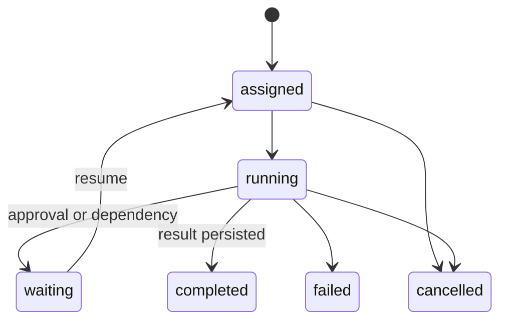

# Delegation, leasing, and result handoff

The root agent delegates one graph task to one child through a durable delegation record. Creating the child and delegation is atomic.

## Task leases

Before execution, Loom atomically creates an active lease and writes `ownerAgentId`, `leaseId`, and `leaseExpiresAt` to the task. Another agent cannot acquire an unexpired lease. Completion, failure, approval pause, and cancellation release it.

Recovery reuses the existing child and delegation for unfinished work. The tool execution ledger prevents Loom from silently replaying a call recorded as `executing` or `unknown`.

## Structured results

A child returns a status, summary, optional artifacts, task updates, findings, failure policy, and error. Loom persists the result before notifying the parent. The parent consumes the summary and artifact references; it does not import the child's complete context.

Result messages use a stable id derived from the delegation. An acknowledged result cannot be consumed again, including after reviewer-driven repair reopens an earlier task.

## Failure decisions

- `retryable`: reassign within the task retry budget.
- `non_retryable`: fail the task.
- `blocked` or `needs_human`: block the task for intervention.
- `needs_approval`: keep the same child waiting for a durable decision.
- `cancelled`: cancel the delegation and release its lease.

Reviewer rejection reopens the nearest implementation task and resets downstream verification tasks. The decision is persisted and traced.
