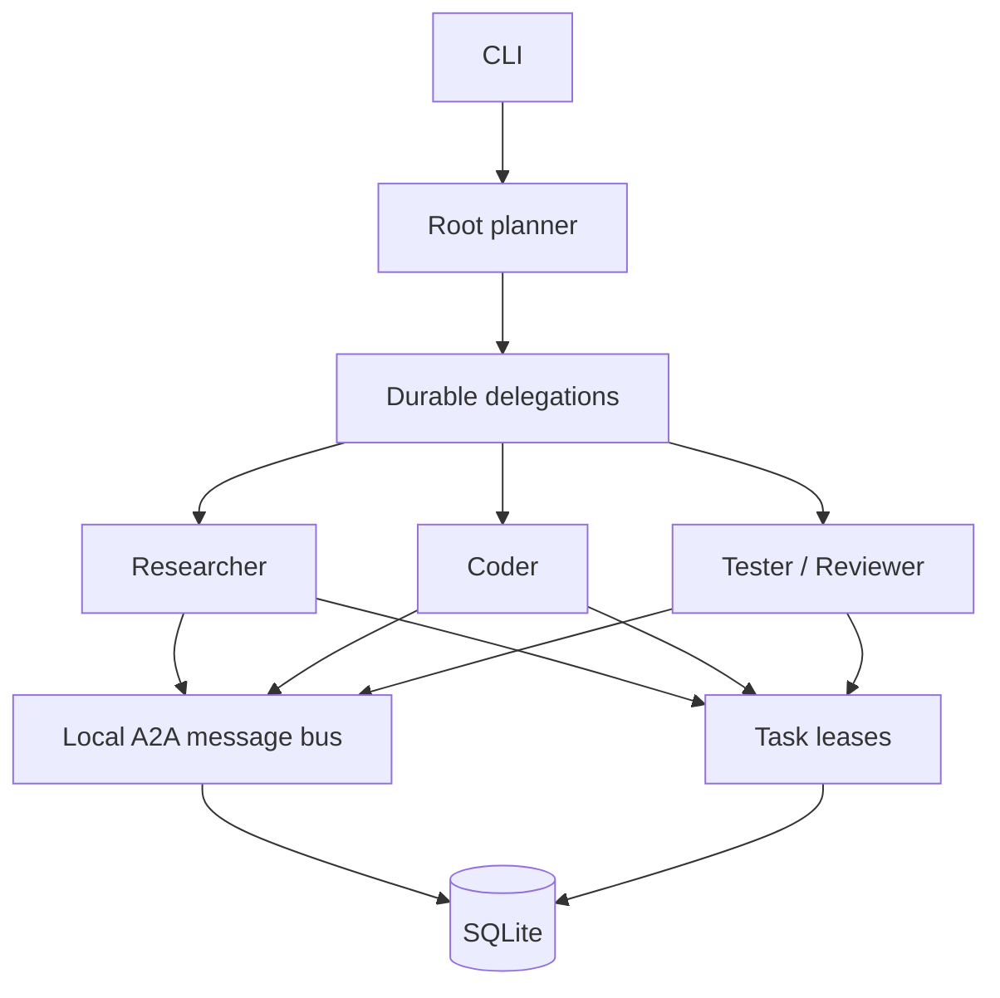

# Local multi-agent runtime

Loom V0.4 is a **local durable multi-agent runtime**. One root planner owns the plan. Bounded child agents receive individual tasks as researcher, coder, tester, reviewer, or general workers. Every identity, relationship, task assignment, result, and recovery decision persists in SQLite.

## Agent identity

Each agent stores `id`, `parentAgentId`, `rootAgentId`, `role`, `goal`, lifecycle status, timestamps, result, and error. Child records remain inspectable after the process exits.

Statuses are `created`, `running`, `waiting`, `paused`, `recovering`, `completed`, `failed`, `cancelled`, and the legacy `stopped` state.

## Roles and tool boundaries

Built-in role definitions live outside the coordination loop. They provide instructions, allowed tools, and completion criteria:

| Role | Default tools |
| --- | --- |
| `planner` | `read_file`, `shell` |
| `researcher` | `read_file`, `shell` |
| `coder` | `read_file`, `write_file`, `shell` |
| `reviewer` | `read_file`, `shell` |
| `tester` | `read_file`, `shell` |
| `general` | `read_file`, `write_file`, `shell` |

Add `.loom/agents/<role>.md` to replace that role's instructions. Project permission settings still apply, and a role can only restrict tools further.

## Context isolation

A child context contains its role, goal, assigned task, a concise parent summary, visible working memory, allowed tools, and messages addressed to that child. Loom does not copy the parent's full model history or another child's private state.

Memory scopes are `agent`, `root-task`, and `project`. Visibility is `private`, `parent-visible`, or `team-visible`. Project writes require explicit policy through the package API.

## Concurrency

`agents.maxConcurrent` and `--max-agents` bound concurrent child execution. The default is 2. V0.4 coordinates one local process and one local SQLite database; it does not provide distributed workers or a daemon.
